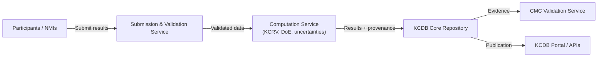

# Architecture Vision  
## Harmonised Digital Model for KCDB Comparison Reporting & CMC Validation

**Version:** 0.1  
**Status:** Draft  
**Date:** 2025-12-21  
**Owner:** BIPM / KCDB Architecture Working Group  

---

## 1. Purpose

This document defines the **Architecture Vision** for establishing a harmonised,
machine-readable data model and supporting architecture for reporting
key comparison (KC) results to the BIPM KCDB and for enabling systematic
**CMC validation based on Degrees of Equivalence (DoE)**.

---

## 2. Business Drivers

- High diversity of comparison result formats across CCs and domains.
- Manual effort in consolidating, validating, and publishing KC results.
- Limited machine-actionable support for CMC validation.
- Increasing demand for digital traceability and reuse of metrological data.
- Alignment with Digital SI and FAIR data principles.

---

## 3. Objectives

The architecture shall:

- Establish a **canonical core data model** for KC reporting.
- Explicitly support **DoE, DoE uncertainty, and NMI uncertainty** for CMC validation.
- Enable **automated validation** of submissions.
- Support **core + domain extensions** for physics and chemistry fields.
- Be based on **open standards** (JSON Schema, Markdown, Mermaid).
- Provide governance for **versioning and evolution**.

---

## 4. Scope

### In Scope
- KC and supplementary comparison reporting.
- Results, uncertainties, reference values, DoEs, correlations.
- Submission, computation, review, publication, and CMC validation workflows.
- Logical and physical data models.
- Interfaces to KCDB and validation services.

### Out of Scope (initially)
- Raw measurement series from laboratories.
- Pilot comparison
- Internal LIMS or laboratory systems.
- Detailed numerical algorithms for KCRV computation (only interfaces).

---

## 5. Stakeholders

| Stakeholder | Concern |
|-------------|---------|
| BIPM KCDB Secretariat | Data quality, consistency, automation |
| Consultative Committees | Domain fit, scientific correctness |
| Pilot Laboratories | Practical submission & tooling |
| NMIs / DIs | Effort, clarity, reuse for CMCs |
| CMC Review Bodies | Transparent DoE-based evidence |
| IT Providers | Stable schemas and APIs |

see stakeholders_concerns.md  for the detailed analysis of concerns.
---

## 6. High-Level Requirements

- Machine-readable submission format.
- Explicit representation of:
  - measurands,
  - participant results,
  - reference values,
  - DoEs and their uncertainties,
  - correlation models.
- Versioned, immutable publication records.
- Backward compatibility where feasible.
- Extensible without forking the core model.

---

## 7. Architecture Principles

- **Single Source of Truth:** One canonical model for KC reporting.
- **Core + Extensions:** Minimal common core, domain-specific extensions.
- **Semantics First:** Quantities, units, uncertainty, provenance are explicit.
- **Open by Design:** Use open formats and standards.
- **Governed Evolution:** Changes via formal review and versioning.
- **Automation-Ready:** Schemas drive validation and tooling.

---

## 8. Target Architecture (High Level)

---

## 9. Expected Benefits

- Reduced manual processing for KCDB ingestion.
- Improved consistency and quality of reported data.
- Transparent, repeatable CMC validation using DoEs.
- Better reuse of data for analytics and reporting.
- Faster onboarding of new domains and comparisons.

---

## 10. Risks & Constraints

- Achieving consensus across diverse domains.
- Legacy data migration complexity.
- Tooling maturity and adoption.
- Need for sustained governance and resourcing.

---

## 11. Success Criteria

- At least two CC domains successfully pilot the model.
- Submissions validated automatically against schema.
- DoEs and uncertainties consumable by CMC validation tools.
- Positive feedback from pilots and reviewers.
- Governance process in operation.

---

## 12. Next Steps

- Approve Architecture Vision.
- Launch baseline assessment (formats & processes).
- Establish glossary and conceptual model working group.
- Start Phase B (Business) and Phase C (Data) in parallel.

---